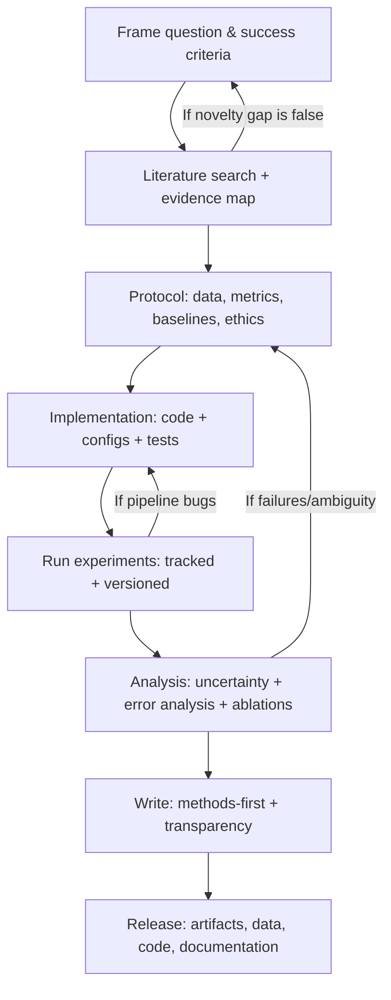
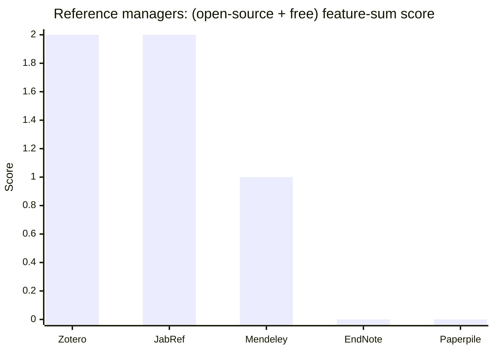

# Meta-Level Research Playbook for AI and Science

## Executive summary

High-quality AI research and general scientific research converge on the same core idea: treat discovery as an *error-correcting pipeline*—one that deliberately reduces bias, ambiguity, and “researcher degrees of freedom,” and that makes results inspectable and repeatable by others. Large-scale metascience work emphasizes that low power, flexible analyses, publication incentives, and incomplete reporting can systematically inflate false positives and reduce reproducibility; practical countermeasures exist and are increasingly standardized. citeturn2search0turn1search0turn1search5turn1search2turn1search7

A pragmatic “minimum viable rigor” workflow (you can scale up from here) is:

- **Define a question worth answering** using explicit criteria such as feasibility/novelty/ethics/relevance (FINER), and pre-commit what success looks like (metrics, baselines, effect size or target improvement). citeturn14search0turn14search12  
- **Run a documented literature search** (multiple databases + structured search strings + citation-chasing), and track inclusion/exclusion with a protocol and a PRISMA-style audit trail. citeturn6search0turn6search1turn0search4turn0search16  
- **Design experiments as if you will publish artifacts**: fixed data splits, controls, ablations, multiple seeds, and explicit uncertainty reporting. citeturn2search7turn3search3turn15search5  
- **Instrument the project for reproducibility**: version control, environment export, experiment tracking, and (when needed) containerization. citeturn17search4turn16search2turn16search23  
- **Disseminate with transparency standards** (TOP/open materials, FAIR for data, clear model/dataset documentation), and align your writing with established reporting guidelines appropriate to study type. citeturn18search0turn0search3turn4search4turn4search5turn0search9turn0search14  

The rest of this playbook operationalizes each stage with templates, checklists, tooling comparisons, and workflow diagrams grounded in widely used standards and seminal references.

## Science of science

Metascience (“science of science”) studies how scientific work is produced, evaluated, disseminated, and rewarded at scale, using large datasets and cross-disciplinary methods to understand why some research trajectories reliably accumulate knowledge while others generate fragile or irreproducible results. citeturn2search0

Several well-documented failure modes matter directly for AI and computational research:

- **Low power + bias + flexible analysis pipelines** can make published “discoveries” less likely to be true, especially in fields where many hypotheses are tested and only “positive” results are selected for publication. citeturn1search0turn1search7  
- **Researcher degrees of freedom** (e.g., stopping rules, excluding observations, multiple plausible metrics/thresholds) can dramatically inflate false-positive rates when not constrained or transparently reported. citeturn1search5  
- **Replication and effect size degradation** have been observed in large-scale replication efforts, motivating more rigorous and transparent practices. citeturn1search2turn1search7  
- **Overreliance on statistical significance** is a known pitfall: p-values do not measure the probability a hypothesis is true, and multiple-comparisons issues can arise even without explicit “p-hacking,” via data-contingent analytical choices (“garden of forking paths”). citeturn3search0turn3search1  

Countermeasures are not vague ideals—they are *operational interventions*:

- **Preregistration** explicitly records the research plan in advance, reducing undisclosed analytic flexibility and clarifying which analyses were confirmatory vs exploratory. citeturn5search4  
- **Registered Reports** move peer review *before* data collection, shifting incentives from “positive results” to question importance and methodological quality. citeturn2search9turn2search5  
- **Transparency standards** like the TOP Guidelines provide a structured policy framework for openness that increases the verifiability of empirical claims. citeturn18search0turn18search4  
- **Reproducibility checklists** in ML venues formalize expectations about reporting datasets, code, compute, and evaluation; for example, the NeurIPS checklist explicitly targets reproducibility, transparency, ethics, and societal impact. citeturn2search2turn2search7  
- **Computational artifact standards** (repeatability/replicability/reproducibility distinctions) help align expectations for what “reproducing results” means in computational experiments. citeturn5search3  

A useful mental model: run your project as an *audit-ready pipeline*. If you cannot explain (1) what was decided, (2) when it was decided, (3) what alternatives existed, and (4) why the chosen path is defensible, you are accumulating “invisible uncertainty” that can later surface as irreproducible results or ambiguous conclusions. citeturn1search7turn2search7turn3search1

## Brainstorming and ideation

### A practical divergence-to-convergence loop

A robust ideation process alternates **divergence** (generate many plausible directions) and **convergence** (select and refine using explicit criteria), with at least one “bias-reducing” checkpoint before committing to the main path. This mirrors the logic of structured, human-centered and consensus-based methods: design thinking emphasizes iterative cycles (empathize/define/ideate/prototype/test), while Delphi-style approaches structure expert consensus under uncertainty. citeturn14search14turn14search15turn14search3

A repeatable loop you can use for AI research:

1. **Problem landscape map**: list 10–30 candidate problems, each as a one-sentence “claim you want to make.”  
2. **Trajectory sketching**: for each candidate, outline 2–3 plausible research arcs (baseline → improvement → generalization/limits).  
3. **Feasibility & ethics gate**: quickly eliminate directions that are infeasible or ethically problematic (e.g., human subjects without a path to review/consent, likely privacy violations, or unsafe deployment contexts). citeturn14search0turn13search0turn13search1  
4. **Convergent scoring**: apply explicit criteria (template below), pick 1–3 front-runners. citeturn14search0turn14search12  
5. **Prototype & falsify**: run “fast falsification” experiments designed to *fail quickly* if the direction is wrong (cheap baselines, sanity checks, and data leakage checks). citeturn2search7turn3search3  
6. **Commit to a protocol**: once the path looks viable, lock the experimental plan (preregistration or an internal “registered protocol”) before large-scale iteration. citeturn5search4turn2search9  

### Bias mitigation during ideation

Bias mitigation is not only about fairness; it is also about *methodological bias* (overfitting to metrics, confirmation bias, outcome switching). Strong practices:

- **Separate exploratory vs confirmatory goals**, and label them explicitly in your docs and later in the paper; preregistration and Registered Reports formalize this separation. citeturn5search4turn2search9turn2search5  
- **Constrain degrees of freedom up front** (primary metric, primary dataset/split, primary baseline set), because analytic flexibility can inflate false positives. citeturn1search5turn3search1  
- **Reward null results internally**: negative findings can be highly informative about which trajectories are dead ends, and metascience argues these are currently under-produced due to incentive structures. citeturn1search7turn18search4  

### Template: brainstorming prompt bank

```text
BRAINSTORMING PROMPTS (AI + general science)

Problem & contribution
- What is the smallest, sharpest claim we want to be able to defend?
- If we succeed, what changes for (a) theory, (b) practice, (c) measurement?
- What is the “obvious baseline” that must be beaten to matter?

Mechanism & assumptions
- What assumption is currently taken for granted that may be false?
- What mechanism would explain the effect if the result is real?
- What conditions would make the method fail (distribution shift, noise, scale)?

Data & measurement
- What is the target population / distribution? What is the sampling process?
- What labels are assumed “ground truth,” and how might they be biased?
- What data leakage pathways exist (duplicates, temporal leakage, test contamination)?

Evaluation & falsification
- What metric best matches the real objective (and what metric is easiest to game)?
- What “sanity check” would immediately invalidate our pipeline if it fails?
- What ablations distinguish “real contribution” from incidental engineering?

Generalization & robustness
- What is the intended scope: in-domain, cross-domain, cross-lingual, cross-device?
- What slices/subgroups matter, and how will we check performance across them?
- What uncertainty should be reported (across seeds, across folds, across datasets)?

Ethics & downstream impact
- Are there human subjects? Identifiable data? Potential for harm or misuse?
- What is the minimal risk mitigation plan (consent, de-identification, access limits)?
- What should we disclose so others can judge appropriateness of use?

Science-of-science angle
- Could we pre-register the main analysis?
- Can we design the result to be replicable by an independent team?
- What would be a convincing “failed replication,” and would we publish it?
```

### Template: convergence scoring rubric

Use a simple 1–5 scale per criterion, then discuss disagreements. FINER provides a widely used baseline (Feasible, Interesting, Novel, Ethical, Relevant). citeturn14search0turn14search12

```text
IDEA SCORING RUBRIC (1–5 each)
- Feasible: data/compute/access/time/skills exist to execute now
- Interesting: someone other than us will care; clear user or scientific value
- Novel: not just a reimplementation; distinct claim or new evidence
- Ethical: credible path to ethics review, consent, privacy, safety
- Relevant: advances understanding or practice; not just leaderboards

AI-specific add-ons (1–5 each)
- Evaluability: clear primary metric + baseline set + stopping rule
- Reproducibility: can we release code/data/weights or strong proxies?
- Robustness: explicitly tests hard cases, distribution shift, or confounders
- Risk control: known failure modes and mitigation plan are documented
```

## Literature review

### Search strategy: from “finding papers” to “building an evidence map”

A rigorous literature review begins with a **review protocol**: your research question(s), inclusion/exclusion criteria, databases, search strings, and screening plan. Systematic review practice emphasizes documenting and reporting the search so it can be audited and rerun, and PRISMA provides a standardized reporting framework for that transparency. citeturn0search4turn0search16turn6search0

Key search-design guidelines (portable across domains):

- **Use multiple sources** because no single index covers everything; Cochrane guidance treats multi-database searching and complementary strategies as central to comprehensive retrieval. citeturn6search0turn6search16  
- **Peer review your search strings** using structured methods such as PRESS, which was designed to improve the quality and completeness of electronic search strategies for evidence synthesis. citeturn6search1  
- **Document the entire search**: databases used, date ranges, full query strings, and any filters; PRISMA supports reporting what you did and why. citeturn0search4turn0search0  

### Screening: inclusion/exclusion and traceability

A defensible review makes it easy to answer: “Why is paper X in or out?” PRISMA’s 27-item checklist and accompanying guidance emphasize reporting the rationale, methods, and study selection process in a structured way. citeturn0search4turn0search16turn0search0

Practical screening recommendations:

- Define **inclusion/exclusion criteria** in advance (topic, population/data regime, methodology, outcomes/metrics, publication type, language, timeframe). citeturn0search4turn6search0  
- Track screening in a **single source of truth** (a spreadsheet or a review tool), recording at least: decision (include/exclude), reason, and reviewer initials. citeturn0search4turn6search0  

### Reading and note-taking that scales

A literature review is an information-processing problem. A widely cited, practical “three-pass” reading method encourages: (1) a fast first pass for gist and relevance, (2) a second pass for understanding, and (3) a third pass for deep verification and reproduction-relevant details. citeturn6search2

Use a note schema that supports synthesis:

- **One-slide summary** per paper (claim, method, data, evaluation, limitations).  
- **Extraction fields** aligned to your research question (variables, datasets, assumptions, comparators, failure cases).  
- **Synthesis map**: cluster papers by *claims and mechanisms*, not by venue. citeturn6search2turn2search0  
   
## Experimental design

### Hypotheses, variables, controls, and datasets

Design in AI research often fails not because models are weak, but because *claims are underspecified*. A defensible experiment makes claims testable by pinning down:

- **Hypothesis or research question**: what should change, compared to what baseline, under what conditions.  
- **Variables**: inputs, outputs, confounders, and what is held constant.  
- **Controls and baselines**: what “no new idea” looks like (including strong, common baselines).  
- **Data split plan**: train/validation/test definitions and governance (no leakage).  
- **Stopping rules and hyperparameter policy**: what was tuned, where, and how.  

Reproducibility programs and checklists in ML explicitly emphasize reporting dataset details, splits, preprocessing, and code artifacts so others can obtain similar results under the same conditions. citeturn2search7turn2search13

### Reproducibility, preregistration, and Registered Reports

Preregistration is the concrete act of specifying your plan and submitting it to a registry before executing the study; Registered Reports go further by adding pre-data peer review and provisional acceptance based on question importance and methodological quality. citeturn5search4turn2search9turn2search5

In AI, you can adopt the same logic even without a journal workflow:

- Store a “registered protocol” in your repo (or OSF): hypothesis, primary metric, dataset/splits, ablations, and analysis plan. citeturn5search12turn5search4  
- Make deviations explicit (what changed, why, and whether it’s exploratory). This directly addresses the risks from undisclosed flexibility highlighted in metascience. citeturn1search5turn1search7  

### Ethical review and human subjects

If your research involves living individuals via interaction/intervention or identifiable private information, you are in human-subjects territory under widely used regulatory definitions; institutional review boards provide ethical and regulatory oversight, and the Belmont Report articulates core ethical principles that underlie these protections. citeturn13search17turn13search2turn13search0

For cybersecurity/ICT research, the Menlo Report extends Belmont-style principles into that domain. citeturn13search3

### Dataset and model documentation as “design artifacts”

A major best practice in AI science is to treat datasets and models as *documented research objects*:

- **Datasheets for Datasets** propose standardized dataset documentation so consumers understand collection, composition, recommended uses, and risks. citeturn4search4turn4search0  
- **Data Statements** in NLP aim to mitigate system bias and improve scientific clarity by documenting data characteristics and context. citeturn4search2turn4search6  
- **Model Cards** propose standardized model documentation (intended uses, evaluation across conditions/groups, limitations). citeturn4search5turn4search1  

These documents function as “controls against ambiguity”: they reduce hidden assumptions and improve downstream reproducibility and appropriate use. citeturn4search4turn4search5turn2search7

### Template: experiment design protocol

```text
EXPERIMENT DESIGN TEMPLATE (AI + general science)

1) Research question & claim
- One-sentence claim you want to make:
- Hypothesis (directional if appropriate):
- Scope: in-domain / cross-domain / deployment-like / mechanistic / causal?

2) Intended contribution type
- New method / new theory / new dataset / new measurement / replication / negative result
- Why existing evidence is insufficient (2–4 sentences)

3) Data
- Dataset(s): source, access method, license/terms
- Population/coverage: what does it represent?
- Splits: train/val/test definitions + leakage prevention plan
- Preprocessing: deterministic steps, tooling, and versioning plan

4) Variables & controls
- Primary independent variable(s):
- Primary dependent metric(s):
- Controls: baselines, ablations, negative controls, sanity checks

5) Training & compute plan (for ML)
- Model family / architecture choices:
- Hyperparameters: which tuned; which fixed; tuning budget
- Random seeds: how many runs per condition
- Hardware: GPU/TPU/CPU assumptions

6) Analysis plan
- Primary analysis: statistic/metric and decision rule
- Uncertainty: CI method (bootstrap, folds, seeds) + reporting format
- Multiple comparisons: what is being compared; correction strategy if needed
- Error analysis: slices, qualitative audits, behavioral tests

7) Reproducibility artifacts
- Code release plan (repo + tag)
- Data release plan (or access instructions)
- Environment capture (conda/pip + container if needed)
- Experiment tracking (tool + naming scheme)
- Expected run times and storage footprint

8) Ethics & risk
- Human subjects? identifiable data? dual-use concerns?
- IRB/ethics review path (if needed)
- Harm mitigation and disclosure plan

9) Stop criteria & reporting
- When will we stop iterating (budget / plateau / target effect)?
- What will be reported regardless of outcome (negative/neutral results)?
```

## Analysis

### Statistical reasoning and the “post p<0.05” instinct

A core scientific principle is that statistics cannot replace scientific reasoning; professional guidance emphasizes p-values are frequently misunderstood and are not direct measures of hypothesis truth, and should not be used as a single gatekeeper for publishability. citeturn3search0turn3search4

For practical AI research, adopt these defaults:

- Report **effect sizes and uncertainty**, not only point estimates and “significance.” citeturn3search0turn1search0  
- Plan for **multiple comparisons** (many models × many datasets × many metrics), including data-contingent analysis choices; the “garden of forking paths” framing explains how multiple-comparisons problems can emerge even without explicit fishing. citeturn3search1  
- Prefer **pre-specified primary endpoints** and treat secondary analyses as exploratory unless pre-committed. citeturn5search4turn1search5  

### ML evaluation: metrics, cross-validation, and variance

Standard ML tooling documents the purpose and definitions of many key metrics, and also provides guidance on cross-validation workflows for estimating performance. citeturn15search0turn15search5

In modern deep learning and reinforcement learning, evaluation variance and nondeterminism can be large enough that single-run results are misleading; work focused on deep RL emphasizes the need for significance metrics, standardized reporting, and attention to variability across runs. citeturn3search3

Recommended reporting bundle for a single headline result:

- **Primary metric** (with definition and averaging policy). citeturn15search0  
- **Uncertainty across seeds or folds** (mean ± CI or distribution plots). citeturn3search3turn15search5  
- **Calibration / probabilistic quality** when probabilities matter; modern neural nets can be miscalibrated, and temperature scaling (among others) is a standard post-hoc tool discussed in calibration work. citeturn3search2turn3search10  
- **Behavioral or slice-based tests** beyond aggregate accuracy, because aggregate metrics can overestimate generalization and hide fragile behaviors. citeturn19search0turn19search4  

### Error analysis and ablations: turning results into understanding

Two complementary practices improve interpretability of claims:

- **Behavioral testing / test suites**: CheckList explicitly argues held-out accuracy can overestimate performance and provides a methodology for targeted behavioral tests. citeturn19search0turn19search4  
- **Ablation studies**: removing or replacing components to measure their impact helps distinguish which elements drive improvements (and reduces “mystery gains” that won’t replicate). Reproducibility checklists in ML also push toward detailed reporting and justification of experimental components. citeturn2search13turn2search7  

### Uncertainty quantification and calibration: practical defaults

For probabilistic predictions, proper scoring rules like the **Brier score** were introduced in forecasting contexts and remain foundational for assessing probability accuracy. citeturn16search0  
For neural networks, calibration research documents that modern networks can be poorly calibrated and evaluates post-processing methods such as temperature scaling. citeturn3search2turn3search10

A practical UQ toolkit:

- **Across-run uncertainty**: multiple seeds; treat variance as a first-class result. citeturn3search3  
- **Across-split uncertainty**: cross-validation where appropriate, recognizing the training/validation loop. citeturn15search5turn15search1  
- **Probabilistic quality**: calibration curves + a calibration metric (e.g., ECE) plus a proper scoring rule (Brier) when probabilities drive decisions. citeturn3search2turn16search0  
 
### Versioning: code, data, and experiments

For **code**, git branching/merging workflows are the baseline collaboration primitive; official git documentation illustrates common real-world branching and merging flows. citeturn17search2turn17search6

For **data and large artifacts**, plain git is usually insufficient:

- **Git LFS** replaces large files with pointers in the repository while storing file contents remotely, making large datasets and binaries manageable in git-based workflows. citeturn7search2turn7search18  
- **DVC** offers “git-like” versioning of data/models plus pipelines and experiment management; it frames pipelines as repeatable workflows and treats experiments as trackable sets of changes with outputs and metrics. citeturn7search5turn7search1turn7search13  

### Experiment tracking and lineage

Experiment tracking tools reduce ambiguity about what was run and why. Common capabilities include logging parameters/metrics/artifacts and enabling comparisons across runs:

- MLflow describes a tracking system and a model registry that stores lineage, versioning, and lifecycle metadata. citeturn7search3turn7search7  
- Weights & Biases describes adding a few lines of code to track experiments and review results in interactive dashboards. citeturn8search0turn8search18  
- Comet frames an Experiment as a unit of measurable research (a run with parameters/code/results) and provides SDK-based tracking. citeturn8search2turn8search11  
- Neptune documents practices for tracking runs (code/data/environment/parameters) and logging results centrally. citeturn8search22turn8search1  
- ClearML describes an end-to-end AI platform where a Task represents the running experiment with connected components (hyperparameters, artifacts, models). citeturn8search14turn8search20   

### Lab notebooks and “decision provenance”

A consistent theme in reproducible research guidance is that decisions must be written down so future readers (including your future self) can understand and reproduce experimental work; electronic lab notebooks (ELNs) are explicitly recommended as a practical tool for this purpose. citeturn17search0

### Mermaid: end-to-end research workflow



This diagram reflects a “methods-first” loop consistent with preregistration/Registered Reports logic (commit methods before scaling experiments), and with reproducibility programs that emphasize documentation of data, code, and evaluation choices. citeturn5search4turn2search9turn2search7
 
### Template: README skeleton for research repos

```text
# Project Title

## TL;DR
One paragraph: what this is, what claim it supports, and what artifacts are provided.

## Research question & hypothesis
- Research question:
- Hypothesis / expected outcome:
- Scope and intended use:

## Repo structure
Explain key directories: data/, src/, configs/, artifacts/, results/, docs/.

## Reproducing the main result
### 1) Environment
- Option A: conda env create -f environment.yml
- Option B: container image (if provided)

### 2) Data access
- How to download / generate data
- Data version identifiers or checksums
- License/terms

### 3) Run experiments
- Baseline command(s)
- Main experiment command(s)
- Where outputs go (artifacts/, results/)

### 4) Evaluate
- Primary metrics + scripts to reproduce tables/figures
- Expected runtime + hardware assumptions

## Experiment tracking
- Tool used (e.g., MLflow/W&B/DVC/etc.)
- Naming scheme for runs
- How to map paper tables → run IDs

## Limitations & known failure modes
- What doesn’t work, and why

## Ethics & responsible use
- Data privacy, human subjects, constraints on deployment

## Citation
- How to cite this repo/artifacts (include DOI if archived)

## License
- Code license
- Data/model license (if different)
```
  
### Chart: openness and base cost of reference managers

The chart below uses a simple additive score: **+1 if the tool is released under open-source licenses**, **+1 if the tool is free to use (base software)**—based on vendor or official documentation. citeturn20search15turn20search1turn10search1turn20search6turn20search2



## Writing, dissemination, and project management

### Writing as a reproducibility interface

For many readers, your paper is the *API* to your research. Reporting guidelines exist because missing methodological details are a major barrier to evaluation and replication. Examples include CONSORT for randomized trials, STROBE for observational studies, and PRISMA for systematic reviews; the EQUATOR network curates and disseminates many such reporting guidelines. citeturn0search9turn0search14turn0search4turn0search12

For AI research specifically, reproducibility initiatives emphasize including (at minimum):

- Clear claims and limitations  
- Dataset statistics, splits, and preprocessing  
- Baselines and hyperparameter tuning policy  
- Code and artifact availability (or well-justified constraints) citeturn2search2turn2search7turn2search13  

### Dissemination and open science practices

Common dissemination pathways have matured into stable infrastructure:

- **Preprints**: arXiv is a free distribution and open-access archive widely used for rapid sharing, explicitly noting that materials are not peer reviewed by arXiv. citeturn18search1turn18search5  
- **Archival repositories**: Zenodo is positioned as a trusted, open repository to share and preserve research outputs and make them citable long term; it also supports archiving releases from GitHub. citeturn18search2turn5search1  
- **Policy frameworks**: TOP Guidelines provide modular standards intended to increase verifiability of research claims; Open Science Badges incentivize open data, open materials, and preregistration. citeturn18search0turn18search3  

For AI artifacts specifically:

- Use **dataset documentation** (Datasheets / Data Statements) and **model documentation** (Model Cards) so that future users can judge appropriateness and limitations. citeturn4search4turn4search2turn4search5  
- Treat **research software as citable scholarship**; software citation principles were created because software is critical to modern research and must be properly acknowledged. citeturn4search3turn4search7  
- Align your data practices with **FAIR** (Findable, Accessible, Interoperable, Reusable), which explicitly extends beyond “data” to include algorithms, tools, and workflows. citeturn0search3turn0search11  

### Project management: milestones, collaboration, and review cycles

Project management is most effective when it is *artifact-driven*: each milestone ends with a concrete, reviewable object (search protocol, experimental protocol, baseline results, artifact package). This aligns with reproducible workflow guidance emphasizing documentation, version control, and traceability of experimental work. citeturn17search12turn17search4turn2search7

Practical collaboration mechanisms:

- **Define contributor roles** using the CRediT taxonomy to reduce ambiguity about who did what and to make collaboration scalable. citeturn17search1turn17search9  
- **Use version control as the collaboration backbone** (branches, merge requests/pull requests), and treat methodological changes like code changes: review them. citeturn17search2turn9search13turn9search1  
- **Create a data management plan (DMP)** early if you have meaningful data governance obligations; DMPTool describes a DMP as a formal document outlining what you will do with data during and after a project. citeturn17search3turn17search7  

### Template: reproducibility checklist

This checklist is designed to be compatible with ML reproducibility checklists and computational artifact norms (NeurIPS checklist + ML reproducibility guidance + ACM artifact framing), while also incorporating FAIR, software citation, and dataset/model documentation expectations. citeturn2search2turn2search7turn5search3turn0search3turn4search3turn4search4turn4search5

```text
REPRODUCIBILITY CHECKLIST (COMPUTATIONAL / AI)

Claims & scope
[ ] Claims are explicitly stated and match the experiments
[ ] Limitations are explicitly stated (what was not tested; external validity)
[ ] Intended use and non-intended use are documented (Model Card-style if applicable)

Data
[ ] Dataset source + access instructions + license/terms documented
[ ] Dataset statistics documented (sizes, label distributions, key attributes)
[ ] Train/val/test splits documented; leakage risks assessed
[ ] Preprocessing pipeline is deterministic and versioned
[ ] Dataset documentation provided (Datasheet/Data Statement where appropriate)

Code
[ ] Single “entry point” scripts exist to reproduce main tables/figures
[ ] Exact commit hash + release tag for paper version
[ ] Dependencies pinned (environment.yml / lockfile / container)
[ ] Randomness handled: seeds logged; nondeterminism noted

Compute & runtime
[ ] Hardware specified (GPU/CPU type, memory)
[ ] Runtime estimates provided (per experiment; total)
[ ] Any distributed or accelerator-specific assumptions documented

Training & evaluation
[ ] Baselines specified and implemented comparably
[ ] Hyperparameter search space and budget documented
[ ] Primary metric specified; secondary metrics labeled
[ ] Multiple runs reported (seeds/folds) where variance is meaningful
[ ] Uncertainty reported (CI, std, or distribution) with method described
[ ] Ablations included for key components, or explicitly justified if absent
[ ] Error analysis performed (slices, qualitative audits, behavioral tests)

Artifacts
[ ] Trained weights/models shared OR sharing constraints justified
[ ] Artifact package includes configs used for all reported runs
[ ] Experiment tracking links run IDs to paper figures/tables

Archival & citation
[ ] Repository has a license and citation instructions
[ ] Code/software is citable (CITATION.cff or equivalent)
[ ] Archival copy created (e.g., Zenodo archive) when feasible
[ ] Data and software adhere to FAIR where possible

Ethics & compliance
[ ] Human subjects determination and IRB/ethics pathway documented if relevant
[ ] Privacy/risk mitigations documented
[ ] Dual-use or deployment risks discussed when applicable
```


